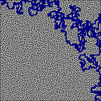

# A* maze solver
Maze solver using the a* search algorithm

## Usage
Download a maze from [this wonderful website](https://keesiemeijer.github.io/maze-generator/#generate)

- **wall thickness should be set to one**
- **maze entries should be set to diagonal**

```python solve.py --maze_path <maze_file> --solve_color```


## Demo




